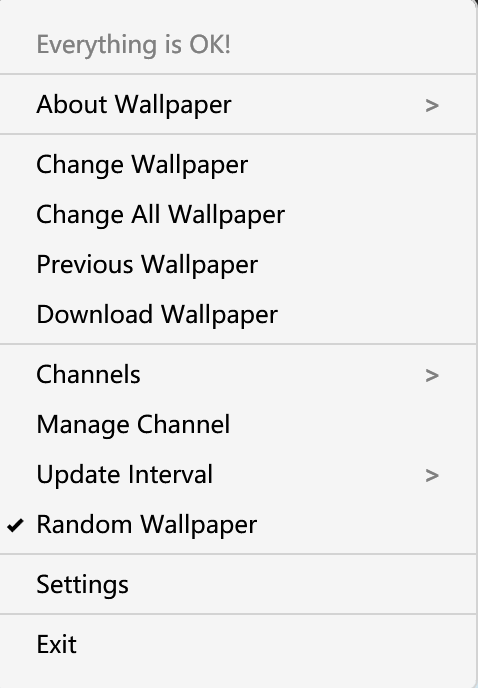
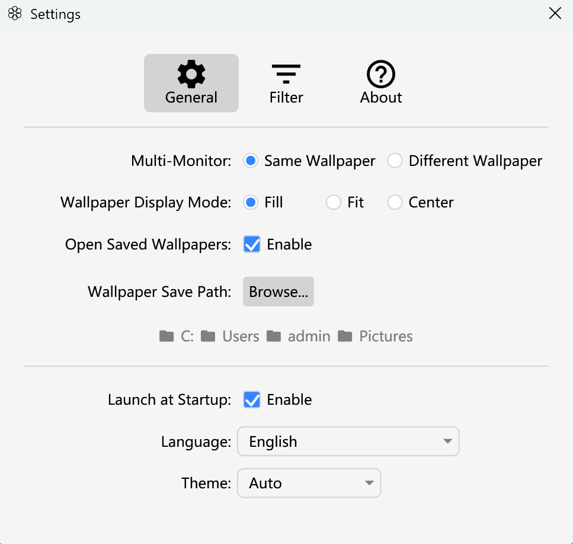
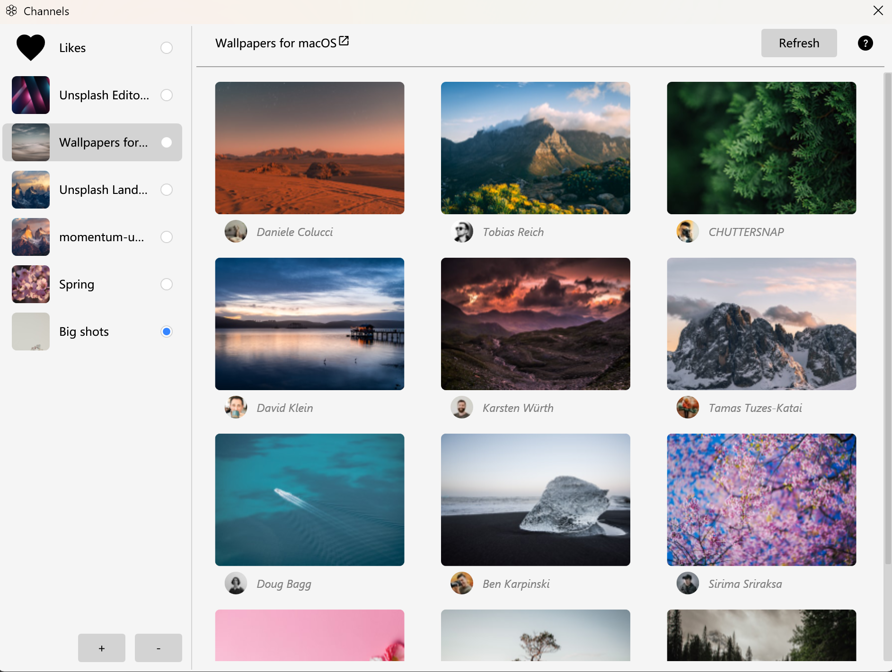

# Irvue for Windows

  

  
  
  
  

  A powerful, elegant, and feature-rich wallpaper management tool for Windows. 
  Inspired by the legendary <a href="https://apps.apple.com/us/app/irvue/id1039633667?mt=12">Irvue</a> for macOS. Powered by <a href="https://unsplash.com">Unsplash</a>.

---

  <a href="#-features--highlights">Features</a> •
  <a href="#-screenshots">Screenshots</a> •
  <a href="#-try-immediately">Getting Started</a> •
  <a href="#-credits">Credits</a> •
  <a href="./README_CN.md">简体中文</a>

---

## ✨ Features & Highlights

### 🌍 Thousands of High-Quality Photos
Integrated with the **Unsplash API**, giving you access to millions of high-resolution professional photos from photographers worldwide.

### 🖥️ Smart Multi-Monitor Support
- **Independent Layouts**: Set different wallpapers for each monitor or sync them across screens.
- **Perfect Fit**: Native support for **Fill**, **Fit**, and **Center** display modes.

### 🗓️ Robust Auto-Change Scheduler
- Flexible intervals from minutes to days.
- **Sleep-Resilient**: Modern scheduling logic ensures wallpapers change accurately even after your computer wakes up from sleep or hibernation.

### 🔍 Advanced Filtering & Personalization
- **Orientation Filter**: Choose between Landscape or Portrait photos to match your hardware layout.
- **Smart Content Filter**: Automatically avoid portraits or photos featuring people if you prefer scenery.
- **Resolution Guard**: Only download wallpapers that meet a certain percentage of your screen's resolution (80%, 90%, or 100%).
- **Blacklist**: Hide specific authors if their style doesn't match your taste.

### 📺 Customizable Channels
Create your own wallpaper sources:
- **Search Channels**: Subscribe to any keyword (e.g., "Minimalist", "Space", "Nature").
- **Collection Channels**: Subscribe to specific Unsplash collections.
- **User Channels**: Follow your favorite photographers.

### 💖 Favorites & History
- **Likes Channel**: Save your favorite wallpapers and enjoy them anytime.
- **History Navigation**: Easily step back to previous wallpapers if you missed one.

### 🎨 Modern Native UI
- **Dark & Light Mode**: Automatically matches your Windows system theme.
- **Minimalist Tray Operation**: Stay in the background with extremely low resource usage.
- **Internationalization**: Fully localized in English and Chinese.

---

## 📸 Screenshots

### 🛠️ Core Experience

  <b>Native Tray Menu</b> 
  <i>Access everything quickly from your system tray.</i> 
  

 

  <b>Powerful Settings</b> 
  <i>Tailor every detail of your wallpaper rotation and filtering.</i> 
  

 

### 📺 Content Management

  <b>Channel Management</b> 
  <i>Organize and subscribe to your favorite photo sources.</i> 
  

 

  <b>Add New Channel</b> 
  <i>Discover content by keywords, collections, or photographers.</i> 
  

---

## 🚀 Try Immediately

1. **Download**: Go to the [Releases](https://github.com/wangy325/Irvue-win/releases) page and download the latest installer.
2. **Install**: Run the installer and launch the application.
3. **Configure**: Right-click the Irvue icon in the system tray to access **Settings** and **Channels**.
4. **Enjoy**: Sit back and let Irvue refresh your workspace.

---

## 📜 License

This project is licensed under the GNU General Public License v3.0 - see the [LICENSE](LICENSE.txt) file for details.

---

## 🙌 Credits

- **Unsplash**: For providing the amazing photo API.
- **Irvue (macOS)**: For the original inspiration.
- **Irvue for Windows**: Developed with ❤️ for the Windows community.

---

  <i>Make your desktop beautiful, every day.</i>

