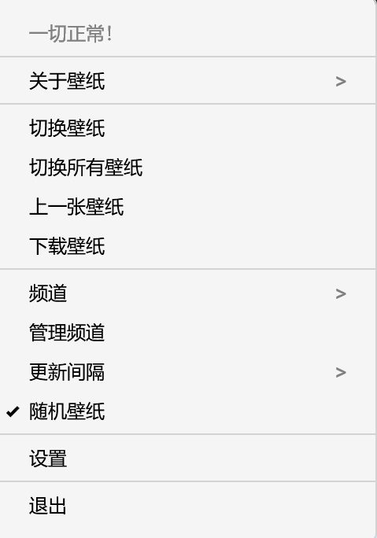
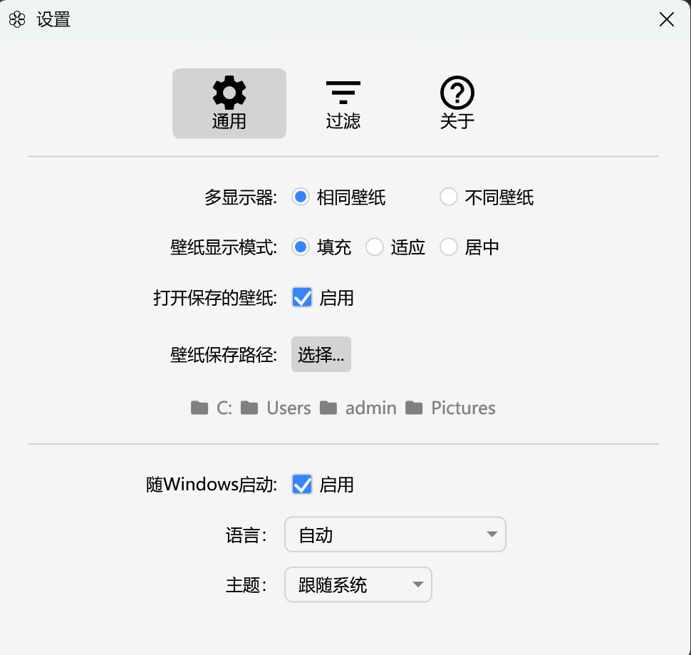
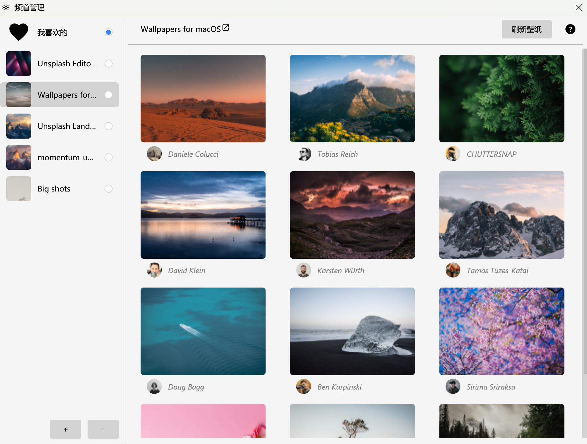
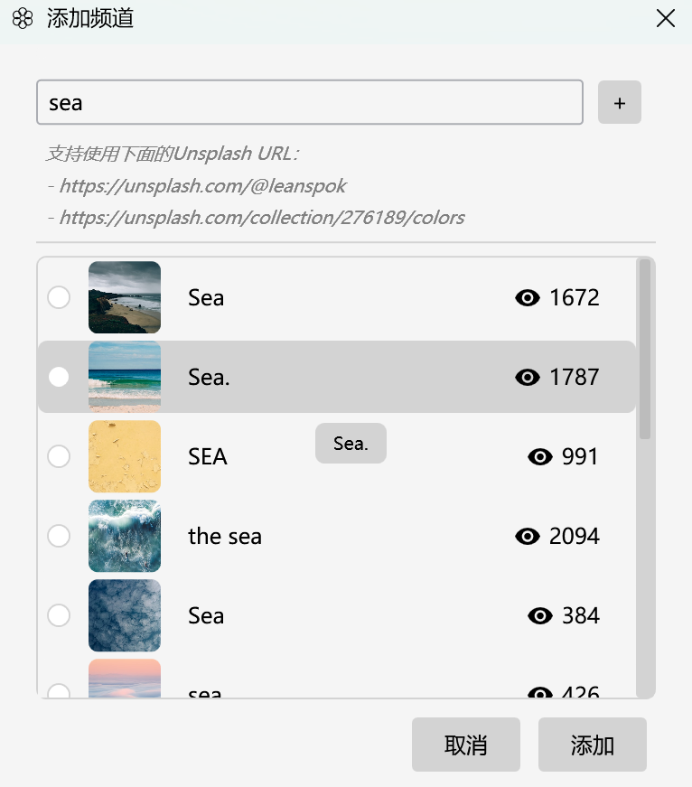

# Irvue for Windows

  

  
  
  
  

  一款功能强大、优雅且充满特色的 Windows 壁纸管理工具。 
  灵感来自 macOS 传奇应用 <a href="https://apps.apple.com/us/app/irvue/id1039633667?mt=12">Irvue</a>。由 <a href="https://unsplash.com">Unsplash</a> 提供技术支持。

---

  <a href="#-功能亮点">功能亮点</a> •
  <a href="#-软件截图">软件截图</a> •
  <a href="#-快速开始">快速开始</a> •
  <a href="#-开发细节">开发细节</a>

---

## ✨ 功能亮点

### 🌍 数百万张高质量照片
整合 **Unsplash API**。您可以随时获取来自全球摄影师、各具风格的高分辨率专业照片。

### 🖥️ 智能多显示器支持
- **独立布局**：为每个显示器设置不同的壁纸，或者让所有屏幕同步显示同一张美图。
- **完美适配**：原生支持多种显示模式：填充（Fill）、适应（Fit）和居中（Center）。

### 🗓️ 稳健的定时切换调度器
- 灵活的时间间隔设置（从分钟到天不等）。
- **休眠唤醒支持**：先进的调度逻辑，确保电脑从睡眠或休眠状态唤醒后，壁纸能够准确按计划更新。

### 🔍 深度过滤与个性化定制
- **图片比例过滤**：根据您的显示器布局，可选择横屏（Landscape）、竖屏（Portrait）壁纸。
- **智能内容过滤**：全新的“智能过滤”功能，支持排除人物/人像照片，让您的桌面专注于优美的风景。
- **分辨率阈值**：仅下载满足显示器分辨率百分比（如 80%、90% 或 100%）的图片，确保视觉效果。
- **黑名单机制**：如果不喜欢某位摄影师的风格，可轻松将其列入忽略名单。

### 📺 自定义壁纸频道
打造您专属的壁纸源：
- **搜索频道**：订阅任何关键词（如“极简”、“宇宙”、“自然”）。
- **画册频道**：订阅特定的 Unsplash 画册（Collections）。
- **用户频道**：关注您喜爱的摄影师。

### 💖 收藏与历史记录
- **心动收藏**：收藏您喜欢的壁纸，随时回味。
- **历史切换**：不小心错过了之前的好图？别担心，可以轻松切换回之前的壁纸。

### 🎨 现代原生界面
- **深色/浅色模式**：自动匹配您的 Windows 系统主题。
- **极简系统托盘操作**：静默运行，占用资源极低。
- **国际化**：全面支持中文和英文。

---

## 📸 软件截图

### 🛠️ 核心体验

  <b>原生托盘菜单</b> 
  <i>通过系统托盘快速访问所有功能。</i> 
  

 

  <b>强大的设置面板</b> 
  <i>精细化定制壁纸轮换、过滤与显示效果。</i> 
  

 

### 📺 内容管理

  <b>画册/频道管理</b> 
  <i>全面组织并订阅您感兴趣的图片源。</i> 
  

 

  <b>添加新画册</b> 
  <i>通过关键词、专题画册或摄影师发现精彩内容。</i> 
  

---

## 🚀 立即尝试

1. **下载安装**：前往 [Releases](https://github.com/wangy325/Irvue-win/releases) 页面下载最新的安装程序。
2. **启动软件**：运行安装包并启动。
3. **轻松配置**：右键点击系统托盘中的 Irvue 图标进入 **设置** 或 **频道**。
4. **即刻享受**：剩下的交给 Irvue，让您的工作环境每天都充满惊喜。

---

## 📜 开源协议

本项目采用 GNU General Public License v3.0 协议开源 - 详情请参阅 [LICENSE](LICENSE.txt) 文件。

---

## 🙌 致谢

- **Unsplash**：感谢其提供的卓越图片 API。
- **Irvue (macOS)**：原作的灵感来源。
- **Irvue for Windows**：用 ❤️ 为 Windows 社区打造。

---

  <i>让您的桌面，每天都遇见美好。</i>

