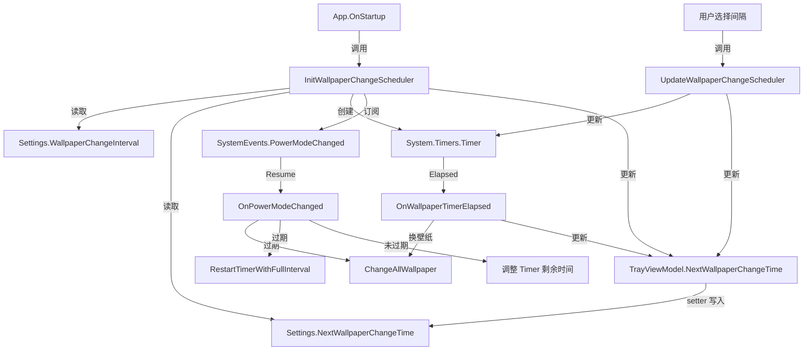

# Timer 业务逻辑审计报告

## 1. 整体数据流



## 2. 逐路径分析

### 2.1 正常启动（无持久化数据）
| 步骤 | 代码位置 | 状态 |
|---|---|---|
| 读 `NextWallpaperChangeTime` 为空 | L404-406 | ✅ 跳过，`startIntervalMs = fullIntervalMs` |
| Timer 设为 `fullIntervalMs`，`AutoReset=false` | L422-425 | ✅ |
| `UpdateNextWallpaperChangeTriggerTime(startIntervalMs)` | L426 | ✅ 正确写入 Settings + 更新 UI |

### 2.2 正常启动（有持久化数据，未过期）
| 步骤 | 代码位置 | 状态 |
|---|---|---|
| 解析出 `nextTrigger`，`remaining > 0` | L408-418 | ✅ `startIntervalMs = remaining` |
| Timer 设为 `remaining` ms | L422 | ✅ |
| `UpdateNextWallpaperChangeTriggerTime(remaining)` | L426 | ✅ UI 显示 `now + remaining` |

### 2.3 正常启动（有持久化数据，已过期）
| 步骤 | 代码位置 | 状态 |
|---|---|---|
| `remaining <= 0` → `ChangeAllWallpaper()` | L409-413 | ✅ 立即换壁纸 |
| `startIntervalMs` 保持 `fullIntervalMs` | L401 | ✅ |
| Timer 设为 `fullIntervalMs` | L422 | ✅ |
| `UpdateNextWallpaperChangeTriggerTime(fullIntervalMs)` | L426 | ✅ |

### 2.4 Timer 正常触发 (`OnWallpaperTimerElapsed`)
| 步骤 | 代码位置 | 状态 |
|---|---|---|
| 换壁纸 | L540 | ✅ |
| 如果 `AutoReset=false`（首次 partial tick）→ 切到全量 | L544-550 | ✅ |
| `UpdateNextWallpaperChangeTriggerTime(interval)` | L552 | ✅ 全量间隔 |

### 2.5 用户手动更改间隔 (`UpdateWallpaperChangeScheduler`)

#### 2.5.1 间隔 → 0（关闭）
| 步骤 | 代码位置 | 状态 |
|---|---|---|
| Stop Timer，置 null | L442-443 | ✅ |
| 取消 `PowerModeChanged` | L444 | ✅ |
| UI 派发 → `MinValue` | L445-449 | ✅ Converter 会显示 "Everything is OK" |

#### 2.5.2 0 → 非零（开启）
| 步骤 | 代码位置 | 状态 |
|---|---|---|
| `_wallpaperTimer == null` → `InitWallpaperChangeScheduler()` | L454-457 | ✅ |

#### 2.5.3 非零 → 非零（更改间隔）
| 步骤 | 代码位置 | 状态 |
|---|---|---|
| Stop → 设新间隔 → `AutoReset=true` → Start | L460-463 | ✅ |
| `UpdateNextWallpaperChangeTriggerTime(interval)` | L464 | ✅ |

### 2.6 睡眠唤醒 (`OnPowerModeChanged`)

#### 2.6.1 持久化数据无效
| 步骤 | 代码位置 | 状态 |
|---|---|---|
| `RestartTimerWithFullInterval(interval)` | L502 | ✅ 内部调了 `UpdateNextWallpaperChangeTriggerTime` |

#### 2.6.2 已过期
| 步骤 | 代码位置 | 状态 |
|---|---|---|
| `ChangeAllWallpaper()` + `RestartTimerWithFullInterval` | L511-512 | ✅ |

#### 2.6.3 未过期（还有剩余时间）
| 步骤 | 代码位置 | 状态 |
|---|---|---|
| Timer → Stop → 设 `remaining` → `AutoReset=false` → Start | L518-521 | ✅ Timer 正确 |
| **更新 UI / Settings** | — | ⚠️ **缺失！见下方 Bug #1** |

---

## 3. 发现的问题

### ✔【️已修复】🐛 Bug #1：`OnPowerModeChanged` 未过期路径没有更新 TrayMenu 显示 

[IrvuewinCore.cs L514-522](file:///c:/Users/admin/Desktop/Irvue-win/Irvuewin/Helpers/IrvuewinCore.cs#L514-L522)

```csharp
else
{
    // Still time left → restart with remaining time
    Logger.Information("Resume: next wallpaper change in {0:F0}s.", remaining / 1000);
    _wallpaperTimer.Stop();
    _wallpaperTimer.Interval = remaining;
    _wallpaperTimer.AutoReset = false;
    _wallpaperTimer.Start();
    // ❌ 缺少 UpdateNextWallpaperChangeTriggerTime(remaining);
}
```

**影响**：睡眠唤醒后如果定时器还没到期，Timer 被正确调整到剩余时间，但 tray menu 显示的时间**不会刷新**（仍是睡眠前的旧值）。虽然 Settings 中的持久化值恰好还是正确的（因为没过期，不需要写新值），但 ViewModel 的 `PropertyChanged` 不会触发，UI 不更新。

**修复**：在该分支末尾添加 `UpdateNextWallpaperChangeTriggerTime(remaining);`

> [!NOTE]
> 严格来说，由于 Settings 中已有正确的时间，这里只需要通过 Dispatcher 触发 `OnPropertyChanged` 就能让 UI 刷新。但为了代码一致性和可读性，直接调用 `UpdateNextWallpaperChangeTriggerTime(remaining)` 更简洁。


### ⚠️ 潜在问题 #2：Converter 不是实时刷新的

[DateTimeToStringConverter.cs](file:///c:/Users/admin/Desktop/Irvue-win/Irvuewin/Helpers/Converters/DateTimeToStringConverter.cs)

```csharp
return dateTime.LocalDateTime > DateTimeOffset.Now
    ? string.Format(culture, "{0} {1:yyyy-MM-dd HH:mm:ss}", ...)
    : Localization.Instance["Tray_Everything_Is_OK"];
```

Converter 内部对比了 `DateTimeOffset.Now`，但 **只有当 binding source 的 `PropertyChanged` 触发时** Converter 才会重新求值。这意味着：

- 如果到了预定时间但 timer 触发前用户打开 tray menu，显示的仍然是 "下次更新 XX:XX" 而不是 "Everything is OK"。
- 这是一个**表现层的边缘情况**，实际不影响功能。

**严重程度**：低。ContextMenu 每次打开都会重新布局，WPF 会重新求值 Converter，所以这个问题在实践中几乎不会被用户察觉。

### ℹ️ 观察 #3：`DtoToVisibilityConverter` 已注册但未使用

`App.xaml` L25 注册了 `DtoToVisibilityConverter`，但 L134-140 的 `MenuItem` 并没有绑定 `Visibility` 到它。这意味着当 `NextWallpaperChangeTime = MinValue`（定时器关闭时），该 MenuItem 仍可见，显示 "Everything is OK" 文本。

**这可能是设计意图**（关闭时也显示状态文本），但如果你希望关闭定时器后完全隐藏该 MenuItem，可以加上：
```xml
<MenuItem ... Visibility="{Binding Source={StaticResource TrayViewModel}, 
    Path=NextWallpaperChangeTime, 
    Converter={StaticResource DtoToVisibilityConverter}}">
```

**严重程度**：不是 bug，是设计选择。

---

## 4. 总结

| # | 类型         | 严重程度 | 位置 | 说明 |
|---|------------|---|---|---|
| 1 | ~~🐛 Bug~~ | **中** | `OnPowerModeChanged` L514-522 | 未过期路径缺少 `UpdateNextWallpaperChangeTriggerTime` 调用 |
| 2 | ⚠️ 边缘      | 低 | `DateTimeToStringConverter` | Converter 内含 `Now` 对比，menu 打开时不刷新 |
| 3 | ℹ️ 观察      | — | `App.xaml` L134 | `DtoToVisibilityConverter` 未绑定到该 MenuItem |
